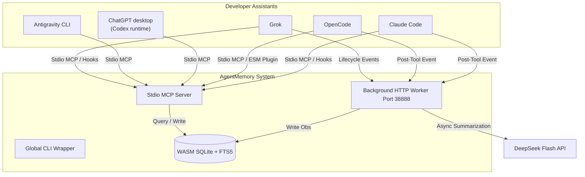

# AgentMemory 🛡️

🌐 [中文版](./README.zh.md) | English

---

AgentMemory is a compilation-free, lightweight, and universal persistent memory system (Universal Agent Memory - UAM). It allows multiple developer agents (such as **Claude Code**, **OpenCode**, **ChatGPT desktop (Codex runtime)**, **Antigravity CLI**, and **Grok**) to share, record, and query context observations and decisions across different workspaces.

### 🌟 Features

*   **Cross-Agent Memory Sharing**: Shares historical session facts, architectural decisions, and bug-fixing notes across different development assistants.
*   **Compilation-Free & Lightweight**: Built with a pure JavaScript in-memory Feature Hashing Vectorizer and WebAssembly SQLite (`node-sqlite3-wasm`), bypassing complex C++ native compiler dependencies (`node-gyp`).
*   **Hybrid Search**: Combines SQLite FTS5 BM25 keyword matching with Cosine Similarity vector retrieval for highly relevant results.
*   **Background Summarization**: Uses the DeepSeek Flash API to summarize session tool logs asynchronously in the background.
*   **Daily Memory Digests**: Runs a daily per-project synthesis job that filters low-signal observations, writes compact fact/decision/action digests, and feeds recent digests into startup context.
*   **Secure Global Config**: Stores API keys and settings globally (`~/.agentmem/.env`) to keep codebase repositories clean and credentials safe.
*   **Loopback Admin Console**: Exposes a local-only `/admin` page for inspecting the database, filtering observations, and toggling global memory read/write gates at runtime.
*   **Persistent Runtime Policy**: Persists `readEnabled` and `writeEnabled` flags in SQLite so runtime gating survives worker restarts.

---

### 🏗️ Architecture



---

### 🚀 Getting Started

#### 1. Prerequisites
*   Node.js (v18+)

#### 2. Installation
Clone the repository and build the distribution files:
```bash
git clone https://github.com/KuanChen01/AgentMemory.git
cd AgentMemory
npm install
npm run build
```

Link the executable globally to register the `agentmem` CLI:
```bash
npm link
```

#### 3. Configuration
Set up your global configuration file in your user home directory:

**File Path**: `~/.agentmem/.env` (Create parent directory `.agentmem` if it doesn't exist)
```env
# General LLM credentials (supports OpenAI, DeepSeek, Mimo, Ark, local Ollama, etc.)
AGENTMEM_LLM_API_KEY=your_api_key_here
AGENTMEM_LLM_API_URL=https://api.deepseek.com/v1
AGENTMEM_LLM_MODEL=deepseek-chat

# Optional: Set to true if your proxy platform doesn't support JSON Mode parameters
AGENTMEM_LLM_DISABLE_JSON_MODE=false

# Optional: Custom JSON headers required by your proxy pools or gateway (e.g. Volcengine Ark)
# AGENTMEM_LLM_HEADERS={"X-Custom-Auth":"value"}

# Local service port
AGENTMEM_PORT=38888
```

#### 4. Automatic Agent Registration
Run the installer to automatically configure settings for **Claude Code**, **OpenCode**, **ChatGPT desktop (Codex runtime)**, **Antigravity**, and **Grok**:
```bash
agentmem install
```

If you want the command to fail whenever any one of the five agents cannot be configured, use:
```bash
agentmem install --strict
```

The installer is now backup-first and merge-first:

- It stores install state in `~/.agentmem/install-state.json`
- It keeps pristine baselines under `~/.agentmem/backups/` when available
- It merges only AgentMemory-owned hooks / MCP entries instead of replacing whole hook arrays

To remove AgentMemory from the current machine without deleting the repo checkout, use:
```bash
agentmem uninstall --strict
```

Add `--purge-all` if you also want to remove the retained install-state and backup artifacts after cleanup.

For a second Windows machine, use the dedicated bootstrap entry instead of repeating the setup manually:
```powershell
.\bootstrap-second-machine.cmd
```

Detailed Chinese walkthrough: [docs/Second Machine Bootstrap Guide.zh.md](./docs/Second%20Machine%20Bootstrap%20Guide.zh.md)

---

### 💻 Command Reference

Run these commands globally from any directory:

*   **Start Worker Manually**: `agentmem start` (optional foreground control; lifecycle hooks safely auto-start the background worker when it is unavailable)
*   **Stop Worker**: `agentmem stop` (sends a graceful shutdown trigger to the local worker)
*   **Check Status**: `agentmem status` (verifies if the port `38888` is active)
*   **Print Version**: `agentmem version`
*   **Run Setup**: `agentmem install` (updates Claude Code, OpenCode, Codex, Antigravity, and Grok settings)
*   **Strict Setup**: `agentmem install --strict` (fails if any one of the five agents cannot be configured)
*   **Uninstall Local Integration**: `agentmem uninstall --strict` (removes AgentMemory-managed hooks, MCP entries, plugin artifacts, `.env`, and database files from the current machine)
*   **Purge Local Install State**: `agentmem uninstall --strict --purge-all` (also removes retained backup and install-state artifacts)
*   **Second-Machine Bootstrap**: `agentmem bootstrap-win --strict` or `bootstrap-second-machine.cmd`
*   **Release Manifest**: `agentmem release-manifest --json` (prints the machine-readable release policy and current version)
*   **Release Plan**: `npm run release:plan -- --next patch|minor|major` (prints the manual release checklist for the next version)
*   **Release Bump**: `npm run release:bump -- --next patch|minor|major` (updates the root package version metadata before a release commit)

### 🪟 Windows Bootstrap

For a same-shape second Windows machine, the recommended path is:

```powershell
git clone https://github.com/KuanChen01/AgentMemory.git
cd AgentMemory
.\bootstrap-second-machine.cmd
```

The bootstrap script runs `npm install`, `npm run build`, creates or validates `%USERPROFILE%\.agentmem\.env`, runs `npm link`, configures all five agents, probes or starts the worker, and opens `/admin`.

If `%USERPROFILE%\.agentmem\.env` is missing, bootstrap writes a blank scaffold and stops with an actionable error. Fill the `AGENTMEM_LLM_*` values, then rerun the command.

### 📦 Release Discipline

AgentMemory now treats product releases as a first-class maintainer workflow:

*   Official releases are published from `master` only.
*   Versioning is strict `SemVer` with tags shaped like `v1.2.3`.
*   The current v1 distribution channel is **GitHub Release + default source archives**.
*   Release metadata is exposed through the CLI (`agentmem release-manifest`) and `/admin/api/overview`, and `/admin/api/release-check` now compares the current checkout against the latest published GitHub Release.

Detailed maintainer workflow: [docs/Release Process.md](./docs/Release%20Process.md)

---

### 🧭 Admin Console

After the worker is running, open:

```text
http://127.0.0.1:38888/admin
```

The admin console is intentionally restricted to loopback clients. It is not exposed to non-local network addresses.

Windows local control now has two entrypoints:

*   `npm run workbench`
*   `start-workbench.cmd`

`npm run workbench` keeps the direct one-click flow: build the repo, probe `http://127.0.0.1:38888/admin/api/overview`, reuse or start the worker, and open `/admin`.

`start-workbench.cmd` is now the interactive control entrypoint. With no arguments it probes the current status first, then shows a one-shot menu for `Start`, `Stop`, `Restart`, `Status`, `Open Admin`, and `Exit`. With arguments it supports:

*   `start-workbench.cmd start|stop|restart|status|open-admin|menu`
*   `start-workbench.cmd start --no-open`
*   `start-workbench.cmd restart --port 38889 --no-open`

The page provides:

*   **Runtime** for global `readEnabled` / `writeEnabled` control, project inventory, daily digest status / manual run / scheduler settings, workbench posture, and a read-only GitHub Release update check with manual upgrade guidance
*   **Procedural Skills** for reviewing digest `skill_candidates`, promoting them to draft, flipping lifecycle status, recording success/failure/rejected/skipped feedback, inspecting feedback history, evidence, lifecycle, recommendation signals, and the latest automatic post-task review artifacts next to task-level query validation
*   **LLM Settings** for switching `AGENTMEM_LLM_MODEL`, updating the OpenAI-compatible API base URL, preserving or replacing the API key, and running a live connection test
*   **Project Context** for the current `ProjectContextView`, recent daily digests, rendered startup text, bounded context package metrics, temporal slice diagnostics, and policy decision trace
*   **State Lab** for explicit structured state reads and writes
*   **Search Diagnostics** for raw hybrid search scores (`hybrid_score`, `fts_score`, `vector_score`) and low-signal title visibility
*   **Observation Ledger** for filterable observation browsing and detailed drill-down

#### Structured state and context view

AgentMemory now separates memory into explicit layers:

*   **Observations** remain the append-only historical ledger used for hybrid search and detailed recall.
*   **State facts** store explicit current or historical truth with `effective_at`, `recorded_at`, and `superseded_at`.
*   **Daily digests** store scheduled or manually triggered per-project summaries with fact, decision, command, open-question, and next-action lists. Digest output is not auto-promoted into state facts.
*   **Procedural skills** are now first-class, reviewable memory objects with draft/enabled/disabled/retired states plus success/failure feedback logs.

The policy brain is now explicit instead of being scattered across hooks and ad-hoc call sites:

*   `memory-policy.ts` centralizes read decisions, suppresses routine read/status/search/view/run tool noise only when it has neither modified-file evidence nor a substantive outcome, and owns draft promotion gates for procedural skill candidates. Explicit `record_memory` milestones, failures, verified findings, and validation results remain recordable.
*   `memory-orchestrator.ts` is the shared Stage 2 read orchestrator used by worker startup context, MCP `get_project_context`, and task-level query resolution.
*   `memory-query.ts` is the task-oriented resolution path that now reuses the shared orchestrator to decide which layers to read, when to consult procedural memory, and how to attach bounded context, temporal diagnostics, and decision trace output.

New interfaces in this first cut:

*   `GET /context?project_path=&limit=&as_of=` returns a `ProjectContextView` object instead of a raw observation array.
*   `GET /state?project_path=&entity_type=&entity_key=&fact_key=&as_of=` reads current or historical structured state.
*   `POST /state` explicitly writes a structured state fact.
*   `POST /memory/query` returns the policy decision, layered context, matching observations, matching procedural skills, a bounded context package, temporal slice diagnostics, and a decision trace for a task query.
*   `POST /search` and `POST /admin/api/search` now accept optional `as_of` filtering for historical replay.
*   MCP tools: `get_project_context`, `query_memory`, `get_memory_state`, `set_memory_state`, `list_procedural_skills`, `promote_skill_candidate`, `set_procedural_skill_status`, `record_procedural_skill_feedback`

`ProjectContextView` combines:

*   `as_of` for time-sliced reconstruction
*   `current_state`
*   `daily_digests` from recent successful daily summaries, trimmed for startup use
*   `procedural_skills` from enabled or draft first-class procedural memory, enriched with feedback summary/history, lifecycle signal, and recommendation state when relevant
*   `summary_blocks` built from curated recent observations with low-signal titles filtered out and duplicate titles collapsed
*   `recent_observations` as a slim startup-oriented metadata list (`id`, `title`, `created_at`, `agent_id`) without full narratives or embeddings
*   `sliding_window` as the compatibility alias for the Stage 2 bounded context package
*   `bounded_context` as the host-facing bounded recent-context package with layer budgets, trimming order, rendered package text, and host responsibilities
*   `temporal_diagnostics` for per-layer `as_of` / latest slice behavior
*   `decision_trace` for why the policy and recommendation path produced the current package
*   `memory_layers` for explicit metadata/profile/recent-summary/ledger/procedural/window separation
*   `generated_at`

Structured state is still **explicit-write only** in this phase. Observations, hook logs, and LLM summaries do not automatically promote themselves into the state layer. Procedural skill candidates also remain **reviewable before promotion**: they can be promoted into draft skills, but they are never auto-enabled.

All lifecycle hooks fail open. Worker requests have a short bounded timeout covering response headers and the complete body (default `1500ms`, configurable with `AGENTMEM_HOOK_TIMEOUT_MS`). Only a refused connection (`ECONNREFUSED` on every connection attempt) triggers one lock-protected detached worker start and a separate startup grace period (default `5000ms`, configurable with `AGENTMEM_HOOK_STARTUP_TIMEOUT_MS`). Timeouts, connection resets, and other ambiguous failures are never retried because the worker may already have accepted a `POST /tools` event. Set `AGENTMEM_HOOK_AUTOSTART=false` to disable hook-driven startup. Lifecycle diagnostics are written to `%USERPROFILE%\.agentmem\worker-status.json`, `worker.pid`, and `logs\worker-autostart.log`; integration tests isolate these files with `AGENTMEM_RUNTIME_DIR`. When summarization is unavailable, successful raw executions are skipped because they contain no extracted outcome or file evidence; actual tool failures are still recorded.

#### Admin-only diagnostics APIs

The workbench also exposes loopback-only admin APIs for the UI:

*   `GET /admin/api/context?project_path=&limit=` returns:
    *   `view`: raw `ProjectContextView`
    *   `rendered`: the same text block produced by `renderProjectContextView(view)`
    *   `metrics`: `payloadBytes`, `summaryCount`, `lowSignalCount`, `duplicateTitleCount`, `proceduralSkillCount`, `slidingWindowEntryCount`, `boundedContextBudget`, `boundedContextCharsUsed`, `boundedContextTrimmedEntries`, `temporalDiagnosticLayerCount`, `decisionTraceStepCount`
*   `GET /admin/api/state?project_path=&entity_type=&entity_key=&fact_key=&as_of=` reads structured state for the workbench
*   `POST /admin/api/state` explicitly writes a structured state fact from the workbench
*   `POST /admin/api/search` returns raw hybrid search diagnostics for the current project without changing the ranking algorithm, and accepts optional `as_of`
*   `POST /admin/api/memory/query` exposes the policy-driven task resolution path used to assemble layered memory context, bounded context packaging, temporal diagnostics, and decision trace output
*   `GET /admin/api/skills?project_path=&status=&as_of=&limit=` lists current procedural skills with feedback history, evidence summary, lifecycle signal, and recommendation metadata
*   `GET /admin/api/post-task-reviews?project_path=&limit=` lists automatic post-task review artifacts generated from the real observation write path, including matched skills, recommendation states, bounded context, temporal diagnostics, and decision trace data
*   `POST /admin/api/skills/promote-candidate` explicitly promotes a digest `skill_candidate` into a draft procedural skill
*   `POST /admin/api/skills/status` flips a procedural skill between `draft`, `enabled`, `disabled`, and `retired`
*   `POST /admin/api/skills/feedback` records success/failure/rejected/skipped feedback for a procedural skill
*   `GET /admin/api/digests?project_path=&limit=` returns recent saved daily memory digests for a project
*   `POST /admin/api/digests/run` manually runs the daily memory digest job for a selected project and optional `local_date`
*   `GET /admin/api/digest-scheduler` returns the persisted daily digest scheduler config and current runtime status
*   `POST /admin/api/digest-scheduler` saves scheduler `enabled`, `schedule_time`, `time_zone`, and `lookback_days`, then applies the new timer to the running worker
*   `GET /admin/api/release-check` compares the current checkout against the latest published GitHub Release and returns manual upgrade guidance for either git checkouts or source archives
*   `GET /admin/api/llm-config` returns a sanitized LLM config snapshot without exposing the full API key
*   `POST /admin/api/llm-config` persists model, API URL, JSON-mode, headers, and optional API key changes to `~/.agentmem/.env` and updates the running worker process
*   `POST /admin/api/llm-test` sends a small OpenAI-compatible `chat/completions` request with the current form values and returns pass/fail diagnostics

#### Runtime policy semantics

*   `readEnabled=false` blocks memory restoration and explicit read APIs:
    *   HTTP: `/context`, `/search`, `/state`, `/memory/query`
    *   MCP: `get_project_context`, `query_memory`, `search_memory`, `memory_timeline`, `get_memory_details`, `get_memory_state`, `list_procedural_skills`
    *   Session-start hooks stop printing restored memory into the agent session
*   `writeEnabled=false` blocks new memory creation:
    *   HTTP: `/tools`, `/sessions`, `/sessions/close`, `/state`, `/admin/api/skills/*`
    *   MCP: `record_memory`, `set_memory_state`, `promote_skill_candidate`, `set_procedural_skill_status`, `record_procedural_skill_feedback`
    *   Post-tool hooks stop producing new observations

Both flags are stored in SQLite `app_settings`, so the selected policy survives worker restarts.

Daily digest reads use the same read gate as startup context, and manual digest runs use the same write gate as observation and state writes. Scheduler settings are persisted in SQLite `app_settings`; the legacy `AGENTMEM_DAILY_DIGEST_DISABLED=true` environment flag only seeds the default value before a scheduler setting is saved.

#### Operating workflow

1. Use `npm run workbench` for the old one-click launch, or use `start-workbench.cmd` for interactive `Start / Stop / Restart / Status / Open Admin` control
2. Open `http://127.0.0.1:38888/admin`
3. Use the `Read Memory` and `Write Memory` switches to change runtime policy
4. Use the Runtime release card to compare the current checkout with the latest GitHub Release and choose the recommended manual upgrade path
5. Use Runtime daily digest controls to inspect the latest per-project digest, manually run one for a selected local date, or change the automatic scheduler's enabled state, run time, time zone, and catch-up window
6. Use `Procedural Skills` to review digest candidates, promote the reusable ones to draft, flip `enabled/disabled/retired`, record operator feedback, inspect automatic post-task reviews, and run a validation query that shows matched skill titles plus the current `rollout_stage`
7. Use `LLM Settings` to switch models or endpoints, save the env-file change, and test the connection before the next summary job
8. Use `Project Context`, `State Lab`, and `Search Diagnostics` to inspect startup context quality, structured state, and current hybrid ranking behavior
9. Use `Observation Ledger` to drill into the raw observation history when needed
10. Use `agentmem status` to confirm reachability and inspect the last runtime state. `agentmem stop` is still available, but the next managed lifecycle hook will start the worker again unless `AGENTMEM_HOOK_AUTOSTART=false` is set

---

### 🔌 Agent Integration Specifications

#### 1. OpenCode (`~/.config/opencode/opencode.jsonc`)
`agentmem install` now writes both the `mcp.agentmem` block and the generated bridge plugin `%USERPROFILE%/.config/opencode/plugins/agentmem-plugin.mjs`. The resulting config shape is:
```jsonc
{
  "mcp": {
    "agentmem": {
      "type": "local",
      "command": ["node", "path/to/AgentMemory/dist/servers/mcp-server.js"],
      "enabled": true
    }
  },
  "plugin": [
    "file:///C:/Users/YourUsername/.config/opencode/plugins/agentmem-plugin.mjs"
  ]
}
```

#### 2. Claude Code
Claude Code uses two different files:

*   `~/.claude.json` for global stdio MCP servers
*   `~/.claude/settings.json` for hooks and other session settings

**`~/.claude.json`**
```json
{
  "mcpServers": {
    "agentmem": {
      "type": "stdio",
      "command": "node",
      "args": ["path/to/AgentMemory/dist/servers/mcp-server.js"],
      "env": {}
    }
  }
}
```

**`~/.claude/settings.json`**
```json
{
  "hooks": {
    "SessionStart": [
      {
        "matcher": ".*",
        "hooks": [{ "type": "command", "command": "node \"path/to/AgentMemory/dist/hooks/claude-session-start.js\"" }]
      }
    ],
    "PostToolUse": [
      {
        "matcher": ".*",
        "hooks": [{ "type": "command", "command": "node \"path/to/AgentMemory/dist/hooks/claude-post-tool.js\"" }]
      }
    ]
  }
}
```

#### 3. ChatGPT desktop (Codex runtime) (`~/.codex/config.toml` and `~/.codex/hooks.json`)
The desktop app is currently branded **ChatGPT**, while its Codex runtime continues to use `~/.codex`. Expose the MCP server in `config.toml`, and register lifecycle hooks in `hooks.json`; keep the `codex-*` hook file names unchanged.

**`~/.codex/config.toml`**
```toml
[features]
hooks = true

[mcp_servers.agentmem]
command = "node"
args = [ "path/to/AgentMemory/dist/servers/mcp-server.js" ]
```

**`~/.codex/hooks.json`**
```json
{
  "hooks": {
    "SessionStart": [
      {
        "matcher": ".*",
        "hooks": [{ "type": "command", "command": "node \"path/to/AgentMemory/dist/hooks/codex-session-start.js\"" }]
      }
    ],
    "PostToolUse": [
      {
        "matcher": ".*",
        "hooks": [{ "type": "command", "command": "node \"path/to/AgentMemory/dist/hooks/codex-post-tool.js\"" }]
      }
    ]
  }
}
```

#### 4. Antigravity CLI
`agentmem install` always updates Antigravity's official global MCP registry at `%USERPROFILE%\.gemini\config\mcp_config.json`. During migration it also updates an existing legacy direct registry (`antigravity-cli`, `antigravity-ide`, or `antigravity`) or an existing Gemini-compatible plugin registry under `%USERPROFILE%\.gemini\config\plugins\*\mcp_config.json`. If your machine keeps an additional registry somewhere else, pass:

```bash
agentmem install --strict --antigravity-config "C:\\path\\to\\mcp_config.json"
```

Generic shape:
```json
{
  "mcpServers": {
    "agentmem": {
      "command": "node",
      "args": ["path/to/AgentMemory/dist/servers/mcp-server.js"],
      "env": { "AGENTMEM_AGENT_ID": "antigravity" },
      "disabled": false
    }
  }
}
```

The installer builds the Antigravity plugin under `%USERPROFILE%\.agentmem\antigravity-plugins\agentmem`, then activates it with `agy plugin install`. Antigravity 1.1.12 stages the imported plugin to `%USERPROFILE%\.gemini\config\plugins\agentmem` and records it in `import_manifest.json`. The plugin bundles `mcp_config.json`, `PreInvocation` / `PostToolUse` / `Stop` hooks, and a frontmatter rule. The official global MCP registry is `%USERPROFILE%\.gemini\config\mcp_config.json` and receives `AGENTMEM_AGENT_ID=antigravity`, so explicit `record_memory` calls that omit `agent_id` no longer fall back to `mcp-client`. `%USERPROFILE%\.agentmem\AGENTMEM_ANTIGRAVITY.md` remains as a readable compatibility copy of the plugin rule.

Preferred Antigravity workflow:

1. Let the `PreInvocation` hook inject startup context automatically.
2. Use `get_project_context`, `search_memory`, or `memory_timeline` only for explicit drill-down, then verify relevant results against current workspace files, diffs, commands, tests, or artifacts.
3. Normal tool work is recorded automatically by `PostToolUse`, and `Stop` closes the session. Use explicit `record_memory(agent_id="antigravity")` only for a deliberate cross-session milestone.
4. Do not treat raw AgentMemory summaries or session recaps as durable truth, and do not record trivial output merely because a task is ending.

This gives Antigravity the same automatic read/write lifecycle as the other hook-backed agents.

#### 5. Grok (`~/.grok/config.toml`)
`agentmem install` registers the stdio MCP server with `AGENTMEM_AGENT_ID=grok`, creates a default `~/.grok/agents/agentmem.md` profile, and writes global lifecycle hooks to `~/.grok/hooks/agentmem.json`. It does not create or require a global `~/.grok/AGENTS.md` file.

```toml
[agent]
name = "agentmem"

[compat.claude]
hooks = false

[mcp_servers.agentmem]
command = "node"
args = [ "path/to/AgentMemory/dist/servers/mcp-server.js" ]
env = { AGENTMEM_AGENT_ID = "grok" }
```

The default profile disables global `AGENTS.md` loading and makes `get_project_context` its first memory read. Grok's passive hooks cannot inject stdout into the model, so the profile owns startup recovery while `SessionStart`, `PostToolUse`, `PostToolUseFailure`, `Stop`, and `SessionEnd` hooks register sessions, record tool work, and close sessions. The installer disables Grok's Claude-hook compatibility only: this prevents the existing Claude post-tool hook from mislabeling Grok activity as `claudecode`; Claude skills and MCP compatibility remain enabled.

### ✅ Smoke Validation Checklist

Use this when validating a live local installation:

1. Precheck: worker starts, `/admin` loads, and the current observation count is readable
2. `read on / write on`: previous memory is restored and a new observation can be recorded
3. `read off / write on`: restored memory disappears, explicit read tools return disabled messages, but new writes still succeed
4. `read on / write off`: memory can still be read, but new writes no longer increase the observation count
5. Restore defaults: turn both toggles back on and verify the persisted policy survives a worker restart

If a smoke check fails, fix only issues directly related to `/admin`, runtime policy gating, or the current agent integration path, then re-run `npm run build` and the affected `tests/*.test.cjs`.

---

### 📄 License
Apache-2.0 License
