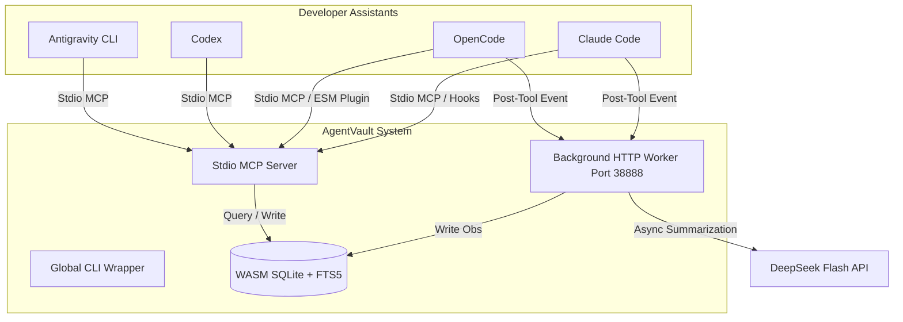

# AgentVault 🛡️

Select Language / 选择语言：

---

<details open>
<summary>🇺🇸 <b>English</b> (Click to collapse/expand)</summary>

<br/>

AgentVault is a compilation-free, lightweight, and universal persistent memory system (Universal Agent Memory - UAM). It allows multiple developer agents (such as **Claude Code**, **OpenCode**, **Codex**, and **Antigravity CLI**) to share, record, and query context observations and decisions across different workspaces.

### 🌟 Features

*   **Cross-Agent Memory Sharing**: Shares historical session facts, architectural decisions, and bug-fixing notes across different development assistants.
*   **Compilation-Free & Lightweight**: Built with a pure JavaScript in-memory Feature Hashing Vectorizer and WebAssembly SQLite (`node-sqlite3-wasm`), bypassing complex C++ native compiler dependencies (`node-gyp`).
*   **Hybrid Search**: Combines SQLite FTS5 BM25 keyword matching with Cosine Similarity vector retrieval for highly relevant results.
*   **Background Summarization**: Uses the DeepSeek Flash API to summarize session tool logs asynchronously in the background.
*   **Secure Global Config**: Stores API keys and settings globally (`~/.agentvault/.env`) to keep codebase repositories clean and credentials safe.

---

### 🏗️ Architecture



---

### 🚀 Getting Started

#### 1. Prerequisites
*   Node.js (v18+)

#### 2. Installation
Clone the repository and build the distribution files:
```bash
git clone https://github.com/KuanChen01/AgentVault.git
cd AgentVault
npm install
npm run build
```

Link the executable globally to register the `agentvault` CLI:
```bash
npm link
```

#### 3. Configuration
Set up your global configuration file in your user home directory:

**File Path**: `~/.agentvault/.env` (Create parent directory `.agentvault` if it doesn't exist)
```env
# DeepSeek API credentials
DEEPSEEK_API_KEY=your_deepseek_api_key_here
DEEPSEEK_API_URL=https://api.deepseek.com/v1

# Local service port
AGENTVAULT_PORT=38888
```

#### 4. Automatic Agent Registration
Run the installer to automatically configure settings for **Claude Code** and **OpenCode**:
```bash
agentvault install
```

---

### 💻 Command Reference

Run these commands globally from any directory:

*   **Start Daemon**: `agentvault start` (launches the background memory consumer service)
*   **Stop Daemon**: `agentvault stop` (sends a graceful shutdown trigger to the daemon)
*   **Check Status**: `agentvault status` (verifies if the port `38888` is active)
*   **Run Setup**: `agentvault install` (updates Claude Code and OpenCode settings configurations)

---

### 🔌 Agent Integration Specifications

#### 1. OpenCode (`~/.config/opencode/opencode.jsonc`)
Add `agentvault` to the `mcp` server config and append the native bridge plugin to the `plugin` array:
```jsonc
{
  "mcp": {
    "agentvault": {
      "type": "local",
      "command": ["node", "path/to/AgentVault/dist/servers/mcp-server.js"],
      "enabled": true
    }
  },
  "plugin": [
    "file:///C:/Users/YourUsername/.config/opencode/plugins/agentvault-plugin.mjs"
  ]
}
```

#### 2. Claude Code (`~/.claude/settings.json`)
Registers stdio MCP tool definitions and workspace lifecycle hooks:
```json
{
  "mcpServers": {
    "agentvault": {
      "command": "node",
      "args": ["path/to/AgentVault/dist/servers/mcp-server.js"]
    }
  },
  "hooks": {
    "SessionStart": [
      {
        "matcher": ".*",
        "hooks": [{ "type": "command", "command": "node \"path/to/AgentVault/dist/hooks/claude-session-start.js\"" }]
      }
    ],
    "PostToolUse": [
      {
        "matcher": ".*",
        "hooks": [{ "type": "command", "command": "node \"path/to/AgentVault/dist/hooks/claude-post-tool.js\"" }]
      }
    ]
  }
}
```

#### 3. Codex (`~/.codex/config.toml`)
Expose tools globally inside the Codex environment config:
```toml
[mcp_servers.agentvault]
command = "node"
args = [ "path/to/AgentVault/dist/servers/mcp-server.js" ]
```

#### 4. Antigravity CLI
Expose memory tools inside your configured plugin's `mcp_config.json`:
```json
{
  "mcpServers": {
    "agentvault": {
      "command": "node",
      "args": ["path/to/AgentVault/dist/servers/mcp-server.js"],
      "disabled": false
    }
  }
}
```

</details>

<details>
<summary>🇨🇳 <b>中文说明</b> (点击展开/收起)</summary>

<br/>

AgentVault 是一个免编译、轻量化的全局持久化智能体记忆系统 (Universal Agent Memory - UAM)。它支持多个主流 AI 辅助编程助理（如 **Claude Code**、**OpenCode**、**Codex**、**Antigravity CLI** 等）在不同工作区开发时共同读取和沉淀开发经验、技术决策和历史上下文。

### 🌟 核心特性

*   **跨 Agent 记忆共享**：允许不同的 AI 编码助理共享同一个项目的历史诊断事实、设计决策和排障记录。
*   **免编译与轻量化**：基于纯 JS 实现的 Feature Hashing 局部敏感向量编码和 WebAssembly 版本的 SQLite (`node-sqlite3-wasm`)，完美避开了复杂的 C++ 本地编译依赖（如 `node-gyp`）。
*   **混合检索检索**：集成 SQLite FTS5 的 BM25 全文关键字匹配与 Cosine Similarity 向量相似度算法，提供高相关的召回效果。
*   **异步后台摘要**：在后台队列中通过 DeepSeek Flash API 异步提炼繁杂的工具执行日志，最大化节省上下文 Token。
*   **全局配置隔离**：API Key 等敏感配置保存在全局用户路径 (`~/.agentvault/.env`) 下，确保源码仓库干净、密钥安全不泄漏。

---

### 🚀 快速上手

#### 1. 环境依赖
*   Node.js (v18+)

#### 2. 安装与构建
克隆本仓库并执行编译：
```bash
git clone https://github.com/KuanChen01/AgentVault.git
cd AgentVault
npm install
npm run build
```

全局注册快捷命令：
```bash
npm link
```

#### 3. 配置密钥
在您当前操作系统的**用户根目录**下创建配置目录与文件：

**配置文件路径**：`~/.agentvault/.env` (若 `.agentvault` 文件夹不存在请先手动创建)
```env
# 填入您的 DeepSeek API Key
DEEPSEEK_API_KEY=您的_deepseek_api_key
DEEPSEEK_API_URL=https://api.deepseek.com/v1

# 本地后台服务监听端口
AGENTVAULT_PORT=38888
```

#### 4. 自动注册集成
运行内置的安装器，它会自动向 **Claude Code** 和 **OpenCode** 写入相应的 hooks 与 MCP 注册参数：
```bash
agentvault install
```

---

### 💻 常用命令

您可以在终端中的任何工作路径直接调用全局快捷命令：

*   **启动后台服务**：`agentvault start`
*   **停止后台服务**：`agentvault stop`
*   **查询运行状态**：`agentvault status`
*   **一键注册配置**：`agentvault install`

---

### 🔌 智能体手动集成配置

#### 1. OpenCode 客户端 (`~/.config/opencode/opencode.jsonc`)
在 `mcp` 块中加入配置，并在 `plugin` 数组中添加对应的钩子插件文件协议地址：
```jsonc
{
  "mcp": {
    "agentvault": {
      "type": "local",
      "command": ["node", "您的开发路径/AgentVault/dist/servers/mcp-server.js"],
      "enabled": true
    }
  },
  "plugin": [
    "file:///C:/Users/您的用户名/.config/opencode/plugins/agentvault-plugin.mjs"
  ]
}
```

#### 2. Claude Code 客户端 (`~/.claude/settings.json`)
注册 MCP 工具及进程执行拦截的 hooks 路径：
```json
{
  "mcpServers": {
    "agentvault": {
      "command": "node",
      "args": ["您的开发路径/AgentVault/dist/servers/mcp-server.js"]
    }
  },
  "hooks": {
    "SessionStart": [
      {
        "matcher": ".*",
        "hooks": [{ "type": "command", "command": "node \"您的开发路径/AgentVault/dist/hooks/claude-session-start.js\"" }]
      }
    ],
    "PostToolUse": [
      {
        "matcher": ".*",
        "hooks": [{ "type": "command", "command": "node \"您的开发路径/AgentVault/dist/hooks/claude-post-tool.js\"" }]
      }
    ]
  }
}
```

#### 3. Codex 客户端 (`~/.codex/config.toml`)
在 TOML 文件的 `[mcp_servers]` 部分直接添加 `agentvault`：
```toml
[mcp_servers.agentvault]
command = "node"
args = [ "您的开发路径/AgentVault/dist/servers/mcp-server.js" ]
```

#### 4. Antigravity 客户端
在您对应的插件配置目录 `mcp_config.json` 中配置：
```json
{
  "mcpServers": {
    "agentvault": {
      "command": "node",
      "args": ["您的开发路径/AgentVault/dist/servers/mcp-server.js"],
      "disabled": false
    }
  }
}
```

</details>

---

### 📄 License
Apache-2.0 License
