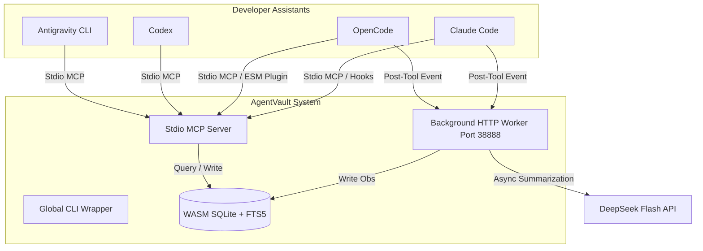

# AgentVault 🛡️

🌐 [中文版](./README.zh.md) | English

---

AgentVault is a compilation-free, lightweight, and universal persistent memory system (Universal Agent Memory - UAM). It allows multiple developer agents (such as **Claude Code**, **OpenCode**, **Codex**, and **Antigravity CLI**) to share, record, and query context observations and decisions across different workspaces.

### 🌟 Features

*   **Cross-Agent Memory Sharing**: Shares historical session facts, architectural decisions, and bug-fixing notes across different development assistants.
*   **Compilation-Free & Lightweight**: Built with a pure JavaScript in-memory Feature Hashing Vectorizer and WebAssembly SQLite (`node-sqlite3-wasm`), bypassing complex C++ native compiler dependencies (`node-gyp`).
*   **Hybrid Search**: Combines SQLite FTS5 BM25 keyword matching with Cosine Similarity vector retrieval for highly relevant results.
*   **Background Summarization**: Uses the DeepSeek Flash API to summarize session tool logs asynchronously in the background.
*   **Secure Global Config**: Stores API keys and settings globally (`~/.agentvault/.env`) to keep codebase repositories clean and credentials safe.

---

### 🏗️ Architecture



---

### 🚀 Getting Started

#### 1. Prerequisites
*   Node.js (v18+)

#### 2. Installation
Clone the repository and build the distribution files:
```bash
git clone https://github.com/KuanChen01/AgentVault.git
cd AgentVault
npm install
npm run build
```

Link the executable globally to register the `agentvault` CLI:
```bash
npm link
```

#### 3. Configuration
Set up your global configuration file in your user home directory:

**File Path**: `~/.agentvault/.env` (Create parent directory `.agentvault` if it doesn't exist)
```env
# DeepSeek API credentials
DEEPSEEK_API_KEY=your_deepseek_api_key_here
DEEPSEEK_API_URL=https://api.deepseek.com/v1

# Local service port
AGENTVAULT_PORT=38888
```

#### 4. Automatic Agent Registration
Run the installer to automatically configure settings for **Claude Code** and **OpenCode**:
```bash
agentvault install
```

---

### 💻 Command Reference

Run these commands globally from any directory:

*   **Start Daemon**: `agentvault start` (launches the background memory consumer service)
*   **Stop Daemon**: `agentvault stop` (sends a graceful shutdown trigger to the daemon)
*   **Check Status**: `agentvault status` (verifies if the port `38888` is active)
*   **Run Setup**: `agentvault install` (updates Claude Code and OpenCode settings configurations)

---

### 🔌 Agent Integration Specifications

#### 1. OpenCode (`~/.config/opencode/opencode.jsonc`)
Add `agentvault` to the `mcp` server config and append the native bridge plugin to the `plugin` array:
```jsonc
{
  "mcp": {
    "agentvault": {
      "type": "local",
      "command": ["node", "path/to/AgentVault/dist/servers/mcp-server.js"],
      "enabled": true
    }
  },
  "plugin": [
    "file:///C:/Users/YourUsername/.config/opencode/plugins/agentvault-plugin.mjs"
  ]
}
```

#### 2. Claude Code (`~/.claude/settings.json`)
Registers stdio MCP tool definitions and workspace lifecycle hooks:
```json
{
  "mcpServers": {
    "agentvault": {
      "command": "node",
      "args": ["path/to/AgentVault/dist/servers/mcp-server.js"]
    }
  },
  "hooks": {
    "SessionStart": [
      {
        "matcher": ".*",
        "hooks": [{ "type": "command", "command": "node \"path/to/AgentVault/dist/hooks/claude-session-start.js\"" }]
      }
    ],
    "PostToolUse": [
      {
        "matcher": ".*",
        "hooks": [{ "type": "command", "command": "node \"path/to/AgentVault/dist/hooks/claude-post-tool.js\"" }]
      }
    ]
  }
}
```

#### 3. Codex (`~/.codex/config.toml`)
Expose tools globally inside the Codex environment config:
```toml
[mcp_servers.agentvault]
command = "node"
args = [ "path/to/AgentVault/dist/servers/mcp-server.js" ]
```

#### 4. Antigravity CLI
Expose memory tools inside your configured plugin's `mcp_config.json`:
```json
{
  "mcpServers": {
    "agentvault": {
      "command": "node",
      "args": ["path/to/AgentVault/dist/servers/mcp-server.js"],
      "disabled": false
    }
  }
}
```

---

### 📄 License
Apache-2.0 License
