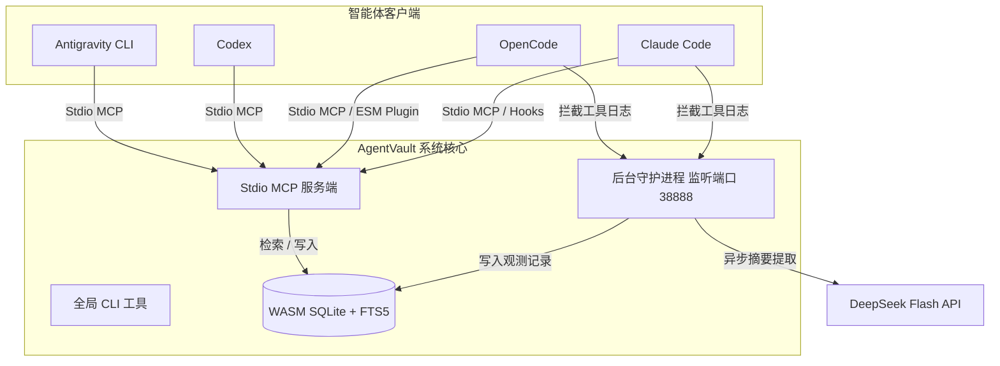

# AgentVault 🛡️

🌐 English | [中文版](./README.md)

---

AgentVault 是一个免编译、轻量化的全局持久化智能体记忆系统 (Universal Agent Memory - UAM)。它支持多个主流 AI 辅助编程助理（如 **Claude Code**、**OpenCode**、**Codex**、**Antigravity CLI** 等）在不同工作区开发时共同读取和沉淀开发经验、技术决策和历史上下文。

### 🌟 核心特性

*   **跨 Agent 记忆共享**：允许不同的 AI 编码助理共享同一个项目的历史诊断事实、设计决策和排障记录。
*   **免编译与轻量化**：基于纯 JS 实现的 Feature Hashing 局部敏感向量编码和 WebAssembly 版本的 SQLite (`node-sqlite3-wasm`)，完美避开了复杂的 C++ 本地编译依赖（如 `node-gyp`）。
*   **混合检索检索**：集成 SQLite FTS5 的 BM25 全文关键字匹配与 Cosine Similarity 向量相似度算法，提供高相关的召回效果。
*   **异步后台摘要**：在后台队列中通过 DeepSeek Flash API 异步提炼繁杂的工具执行日志，最大化节省上下文 Token。
*   **全局配置隔离**：API Key 等敏感配置保存在全局用户路径 (`~/.agentvault/.env`) 下，确保源码仓库干净、密钥安全不泄漏。

---

### 🏗️ 系统架构



---

### 🚀 快速上手

#### 1. 环境依赖
*   Node.js (v18+)

#### 2. 安装与构建
克隆本仓库并执行编译：
```bash
git clone https://github.com/KuanChen01/AgentVault.git
cd AgentVault
npm install
npm run build
```

全局注册快捷命令：
```bash
npm link
```

#### 3. 配置密钥
在您当前操作系统的**用户根目录**下创建配置目录与文件：

**配置文件路径**：`~/.agentvault/.env` (若 `.agentvault` 文件夹不存在请先手动创建)
```env
# 通用 LLM 接口凭证 (支持 OpenAI, DeepSeek, Mimo, 火山方舟, 本地 Ollama 等)
AGENTVAULT_LLM_API_KEY=您的_api_key
AGENTVAULT_LLM_API_URL=https://api.deepseek.com/v1
AGENTVAULT_LLM_MODEL=deepseek-chat

# 可选：如果中转平台/网关不支持 JSON Mode 参数，设置为 true
AGENTVAULT_LLM_DISABLE_JSON_MODE=false

# 可选：针对中转网关或订阅令牌池的自定义 JSON 请求头 (如火山引擎方舟)
# AGENTVAULT_LLM_HEADERS={"X-Custom-Auth":"value"}

# 本地后台服务监听端口
AGENTVAULT_PORT=38888
```

#### 4. 自动注册集成
运行内置的安装器，它会自动向 **Claude Code** 和 **OpenCode** 写入相应的 hooks 与 MCP 注册参数：
```bash
agentvault install
```

---

### 💻 常用命令

您可以在终端中的任何工作路径直接调用全局快捷命令：

*   **启动后台服务**：`agentvault start`
*   **停止后台服务**：`agentvault stop`
*   **查询运行状态**：`agentvault status`
*   **一键注册配置**：`agentvault install`

---

### 🔌 智能体手动集成配置

#### 1. OpenCode 客户端 (`~/.config/opencode/opencode.jsonc`)
在 `mcp` 块中加入配置，并在 `plugin` 数组中添加对应的钩子插件文件协议地址：
```jsonc
{
  "mcp": {
    "agentvault": {
      "type": "local",
      "command": ["node", "您的开发路径/AgentVault/dist/servers/mcp-server.js"],
      "enabled": true
    }
  },
  "plugin": [
    "file:///C:/Users/您的用户名/.config/opencode/plugins/agentvault-plugin.mjs"
  ]
}
```

#### 2. Claude Code 客户端 (`~/.claude/settings.json`)
注册 MCP 工具及进程执行拦截的 hooks 路径：
```json
{
  "mcpServers": {
    "agentvault": {
      "command": "node",
      "args": ["您的开发路径/AgentVault/dist/servers/mcp-server.js"]
    }
  },
  "hooks": {
    "SessionStart": [
      {
        "matcher": ".*",
        "hooks": [{ "type": "command", "command": "node \"您的开发路径/AgentVault/dist/hooks/claude-session-start.js\"" }]
      }
    ],
    "PostToolUse": [
      {
        "matcher": ".*",
        "hooks": [{ "type": "command", "command": "node \"您的开发路径/AgentVault/dist/hooks/claude-post-tool.js\"" }]
      }
    ]
  }
}
```

#### 3. Codex 客户端 (`~/.codex/config.toml`)
在 TOML 文件的 `[mcp_servers]` 部分直接添加 `agentvault`：
```toml
[mcp_servers.agentvault]
command = "node"
args = [ "您的开发路径/AgentVault/dist/servers/mcp-server.js" ]
```

#### 4. Antigravity 客户端
在您对应的插件配置目录 `mcp_config.json` 中配置：
```json
{
  "mcpServers": {
    "agentvault": {
      "command": "node",
      "args": ["您的开发路径/AgentVault/dist/servers/mcp-server.js"],
      "disabled": false
    }
  }
}
```

---

### 📄 开源协议
Apache-2.0 License
